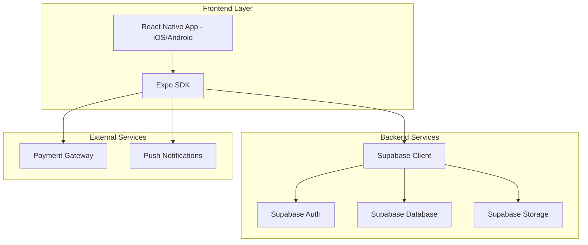
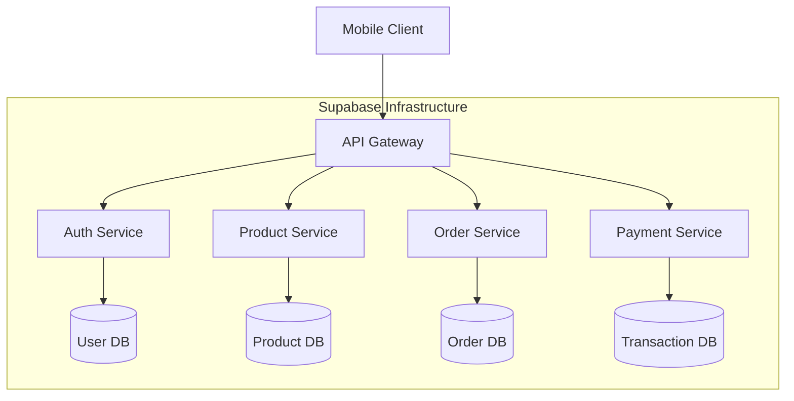
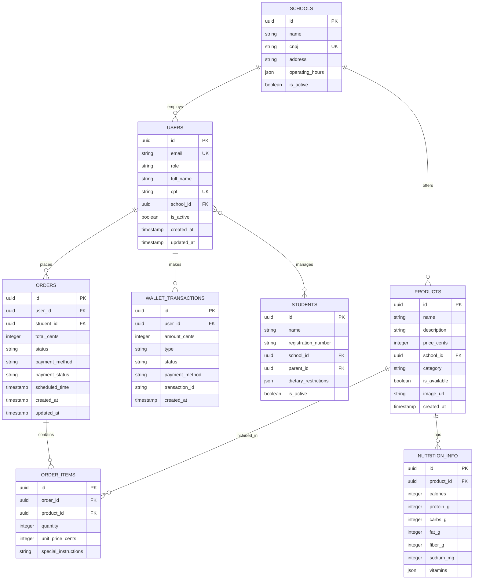

## 1. Architecture design



## 2. Technology Description

- **Frontend**: React Native@0.72 + Expo@49 + NativeWind@2 (Tailwind for React Native)
- **Initialization Tool**: expo-cli
- **Backend**: Supabase (BaaS - Backend as a Service)
- **Database**: PostgreSQL (via Supabase)
- **Authentication**: Supabase Auth (com suporte a biometria via Expo)
- **Storage**: Supabase Storage (para imagens de produtos)
- **Payment**: Integração com PagSeguro/MercadoPago via API
- **Push Notifications**: Expo Notifications + Supabase Realtime

## 3. Route definitions

| Route | Purpose |
|-------|---------|
| /login | Tela de autenticação com opções de login social e biometria |
| /home | Tela inicial com cardápio do dia e navegação principal |
| /product/:id | Detalhes do produto com informações nutricionais completas |
| /cart | Gerenciamento do carrinho de compras |
| /checkout | Processo de pagamento com carteira digital |
| /orders | Lista de pedidos e acompanhamento em tempo real |
| /profile | Perfil do usuário com histórico e configurações |
| /wallet | Gerenciamento da carteira digital e recargas |

## 4. API definitions

### 4.1 Authentication APIs

```
POST /auth/v1/token
```

Request:
| Param Name | Param Type | isRequired | Description |
|------------|------------|------------|-------------|
| email | string | true | Email do usuário |
| password | string | true | Senha do usuário |
| type | string | true | Tipo: 'password' ou 'refresh_token' |

Response:
```json
{
  "access_token": "eyJhbGc...",
  "token_type": "bearer",
  "expires_in": 3600,
  "refresh_token": "-4JS_jk...",
  "user": {
    "id": "123e4567-e89b-12d3-a456-426614174000",
    "email": "pai@email.com",
    "role": "parent"
  }
}
```

### 4.2 Product APIs

```
GET /rest/v1/products
```

Query Parameters:
| Param Name | Param Type | isRequired | Description |
|------------|------------|------------|-------------|
| category | string | false | Filtrar por categoria |
| school_id | uuid | true | ID da escola |
| date | string | false | Data do cardápio (YYYY-MM-DD) |

Response:
```json
[
  {
    "id": "prod_123",
    "name": "Marmita Balanceada",
    "description": "Arroz integral, frango grelhado, legumes",
    "price": 1500,
    "category": "lunch",
    "nutrition_info": {
      "calories": 450,
      "protein": 35,
      "carbs": 45,
      "fat": 12
    },
    "allergens": ["gluten", "soy"],
    "available": true,
    "image_url": "https://storage.supabase.co/..."
  }
]
```

### 4.3 Order APIs

```
POST /rest/v1/orders
```

Request:
| Param Name | Param Type | isRequired | Description |
|------------|------------|------------|-------------|
| user_id | uuid | true | ID do usuário |
| items | array | true | Lista de itens do pedido |
| total_amount | integer | true | Valor total em centavos |
| payment_method | string | true | Método de pagamento |
| delivery_time | string | false | Horário preferencial |

Request Body:
```json
{
  "user_id": "123e4567-e89b-12d3-a456-426614174000",
  "items": [
    {
      "product_id": "prod_123",
      "quantity": 2,
      "unit_price": 1500,
      "notes": "Sem sal"
    }
  ],
  "total_amount": 3000,
  "payment_method": "wallet",
  "delivery_time": "12:00"
}
```

## 5. Server architecture diagram



## 6. Data model

### 6.1 Data model definition



### 6.2 Data Definition Language

```sql
-- Users table
CREATE TABLE users (
  id UUID PRIMARY KEY DEFAULT gen_random_uuid(),
  email VARCHAR(255) UNIQUE NOT NULL,
  role VARCHAR(20) NOT NULL CHECK (role IN ('parent', 'student', 'school_admin')),
  full_name VARCHAR(255) NOT NULL,
  cpf VARCHAR(11) UNIQUE,
  school_id UUID REFERENCES schools(id),
  password_hash VARCHAR(255) NOT NULL,
  is_active BOOLEAN DEFAULT true,
  created_at TIMESTAMP WITH TIME ZONE DEFAULT NOW(),
  updated_at TIMESTAMP WITH TIME ZONE DEFAULT NOW()
);

-- Schools table
CREATE TABLE schools (
  id UUID PRIMARY KEY DEFAULT gen_random_uuid(),
  name VARCHAR(255) NOT NULL,
  cnpj VARCHAR(14) UNIQUE NOT NULL,
  address TEXT NOT NULL,
  operating_hours JSONB NOT NULL,
  is_active BOOLEAN DEFAULT true,
  created_at TIMESTAMP WITH TIME ZONE DEFAULT NOW()
);

-- Students table
CREATE TABLE students (
  id UUID PRIMARY KEY DEFAULT gen_random_uuid(),
  name VARCHAR(255) NOT NULL,
  registration_number VARCHAR(50) NOT NULL,
  school_id UUID NOT NULL REFERENCES schools(id),
  parent_id UUID NOT NULL REFERENCES users(id),
  dietary_restrictions JSONB DEFAULT '[]',
  is_active BOOLEAN DEFAULT true,
  created_at TIMESTAMP WITH TIME ZONE DEFAULT NOW()
);

-- Products table
CREATE TABLE products (
  id UUID PRIMARY KEY DEFAULT gen_random_uuid(),
  name VARCHAR(255) NOT NULL,
  description TEXT NOT NULL,
  price_cents INTEGER NOT NULL CHECK (price_cents > 0),
  school_id UUID NOT NULL REFERENCES schools(id),
  category VARCHAR(50) NOT NULL CHECK (category IN ('breakfast', 'lunch', 'snack', 'dinner', 'beverage', 'dessert')),
  is_available BOOLEAN DEFAULT true,
  image_url TEXT,
  created_at TIMESTAMP WITH TIME ZONE DEFAULT NOW(),
  updated_at TIMESTAMP WITH TIME ZONE DEFAULT NOW()
);

-- Nutrition info table
CREATE TABLE nutrition_info (
  id UUID PRIMARY KEY DEFAULT gen_random_uuid(),
  product_id UUID UNIQUE NOT NULL REFERENCES products(id) ON DELETE CASCADE,
  calories INTEGER NOT NULL,
  protein_g INTEGER NOT NULL,
  carbs_g INTEGER NOT NULL,
  fat_g INTEGER NOT NULL,
  fiber_g INTEGER DEFAULT 0,
  sodium_mg INTEGER DEFAULT 0,
  vitamins JSONB DEFAULT '{}',
  allergens TEXT[] DEFAULT '{}',
  ingredients TEXT NOT NULL
);

-- Orders table
CREATE TABLE orders (
  id UUID PRIMARY KEY DEFAULT gen_random_uuid(),
  user_id UUID NOT NULL REFERENCES users(id),
  student_id UUID NOT NULL REFERENCES students(id),
  total_cents INTEGER NOT NULL CHECK (total_cents > 0),
  status VARCHAR(50) NOT NULL DEFAULT 'pending' CHECK (status IN ('pending', 'confirmed', 'preparing', 'ready', 'delivered', 'cancelled')),
  payment_method VARCHAR(50) NOT NULL CHECK (payment_method IN ('wallet', 'credit_card', 'debit_card', 'pix')),
  payment_status VARCHAR(50) NOT NULL DEFAULT 'pending' CHECK (payment_status IN ('pending', 'approved', 'rejected', 'refunded')),
  scheduled_time TIMESTAMP WITH TIME ZONE,
  created_at TIMESTAMP WITH TIME ZONE DEFAULT NOW(),
  updated_at TIMESTAMP WITH TIME ZONE DEFAULT NOW()
);

-- Order items table
CREATE TABLE order_items (
  id UUID PRIMARY KEY DEFAULT gen_random_uuid(),
  order_id UUID NOT NULL REFERENCES orders(id) ON DELETE CASCADE,
  product_id UUID NOT NULL REFERENCES products(id),
  quantity INTEGER NOT NULL CHECK (quantity > 0),
  unit_price_cents INTEGER NOT NULL CHECK (unit_price_cents > 0),
  special_instructions TEXT,
  created_at TIMESTAMP WITH TIME ZONE DEFAULT NOW()
);

-- Wallet transactions table
CREATE TABLE wallet_transactions (
  id UUID PRIMARY KEY DEFAULT gen_random_uuid(),
  user_id UUID NOT NULL REFERENCES users(id),
  amount_cents INTEGER NOT NULL,
  type VARCHAR(20) NOT NULL CHECK (type IN ('credit', 'debit', 'refund')),
  status VARCHAR(20) NOT NULL DEFAULT 'completed' CHECK (status IN ('pending', 'completed', 'failed')),
  payment_method VARCHAR(50),
  transaction_id VARCHAR(255) UNIQUE,
  description TEXT,
  created_at TIMESTAMP WITH TIME ZONE DEFAULT NOW()
);

-- Create indexes for performance
CREATE INDEX idx_users_email ON users(email);
CREATE INDEX idx_users_cpf ON users(cpf);
CREATE INDEX idx_users_school ON users(school_id);
CREATE INDEX idx_students_parent ON students(parent_id);
CREATE INDEX idx_students_school ON students(school_id);
CREATE INDEX idx_products_school ON products(school_id);
CREATE INDEX idx_products_category ON products(category);
CREATE INDEX idx_products_available ON products(is_available);
CREATE INDEX idx_orders_user ON orders(user_id);
CREATE INDEX idx_orders_student ON orders(student_id);
CREATE INDEX idx_orders_status ON orders(status);
CREATE INDEX idx_orders_created ON orders(created_at DESC);
CREATE INDEX idx_order_items_order ON order_items(order_id);
CREATE INDEX idx_order_items_product ON order_items(product_id);
CREATE INDEX idx_wallet_user ON wallet_transactions(user_id);
CREATE INDEX idx_wallet_created ON wallet_transactions(created_at DESC);

-- Enable Row Level Security (RLS)
ALTER TABLE users ENABLE ROW LEVEL SECURITY;
ALTER TABLE students ENABLE ROW LEVEL SECURITY;
ALTER TABLE products ENABLE ROW LEVEL SECURITY;
ALTER TABLE orders ENABLE ROW LEVEL SECURITY;
ALTER TABLE order_items ENABLE ROW LEVEL SECURITY;
ALTER TABLE wallet_transactions ENABLE ROW LEVEL SECURITY;

-- Create RLS policies
CREATE POLICY "Users can view their own data" ON users FOR SELECT USING (auth.uid() = id);
CREATE POLICY "Users can update their own data" ON users FOR UPDATE USING (auth.uid() = id);

CREATE POLICY "Parents can view their students" ON students FOR SELECT USING (
  auth.uid() IN (SELECT parent_id FROM students WHERE id = students.id)
);

CREATE POLICY "Products are viewable by school members" ON products FOR SELECT USING (
  school_id IN (SELECT school_id FROM users WHERE id = auth.uid())
);

CREATE POLICY "Users can view their orders" ON orders FOR SELECT USING (user_id = auth.uid());
CREATE POLICY "Users can create orders" ON orders FOR INSERT WITH CHECK (user_id = auth.uid());

CREATE POLICY "Users can view their wallet" ON wallet_transactions FOR SELECT USING (user_id = auth.uid());
CREATE POLICY "Users can create wallet transactions" ON wallet_transactions FOR INSERT WITH CHECK (user_id = auth.uid());

-- Grant permissions
GRANT SELECT ON users TO anon;
GRANT SELECT ON students TO anon;
GRANT SELECT ON products TO anon;
GRANT SELECT ON nutrition_info TO anon;
GRANT SELECT ON schools TO anon;

GRANT ALL ON users TO authenticated;
GRANT ALL ON students TO authenticated;
GRANT ALL ON orders TO authenticated;
GRANT ALL ON order_items TO authenticated;
GRANT ALL ON wallet_transactions TO authenticated;

-- Insert sample data
INSERT INTO schools (name, cnpj, address, operating_hours) VALUES
('Escola Municipal Prof. Ana Maria', '12345678000195', 'Rua das Flores, 123 - Centro', '{"breakfast": "07:00-08:00", "lunch": "11:30-13:00", "snack": "15:00-16:00"}'),
('Colégio Estadual João Paulo II', '98765432000158', 'Av. Principal, 456 - Jardim Paulista', '{"breakfast": "07:30-08:30", "lunch": "12:00-13:30", "snack": "14:30-15:30"}');

INSERT INTO products (name, description, price_cents, school_id, category, image_url) VALUES
('Marmita Balanceada', 'Arroz integral, frango grelhado, legumes salteados', 1500, (SELECT id FROM schools LIMIT 1), 'lunch', 'https://example.com/marmita.jpg'),
('Sanduíche Natural', 'Pão integral, frango desfiado, alface, tomate', 800, (SELECT id FROM schools LIMIT 1), 'snack', 'https://example.com/sanduiche.jpg'),
('Suco de Laranja Natural', '500ml de suco natural sem açúcar', 500, (SELECT id FROM schools LIMIT 1), 'beverage', 'https://example.com/suco.jpg');
```