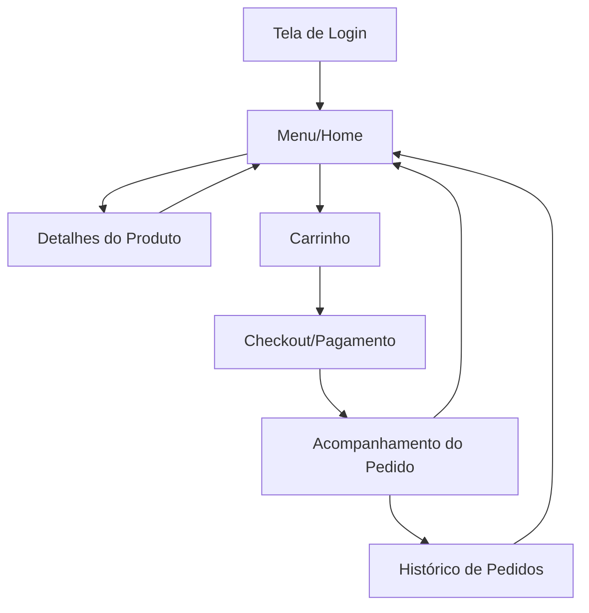

## 1. Product Overview
Ambra Food é um aplicativo móvel de entrega de alimentos escolares que conecta pais e alunos com cantinas escolares. O app permite pedir refeições nutritivas de forma prática e segura, com acompanhamento completo do processo de nutrição e entrega.

O produto visa resolver o problema da alimentação escolar saudável, oferecendo convenência para pais e garantindo que estudantes tenham acesso a refeições balanceadas durante o período escolar.

## 2. Core Features

### 2.1 User Roles
| Role | Registration Method | Core Permissions |
|------|---------------------|------------------|
| Pais/Responsáveis | Cadastro com CPF e vínculo com aluno | Visualizar cardápio, fazer pedidos, gerenciar carteira, acompanhar pedidos |
| Alunos | Cadastro vinculado ao responsável | Visualizar cardápio, fazer pedidos (com aprovação), ver histórico |
| Escola/Cantina | Cadastro institucional | Gerenciar cardápio, nutrição, status de pedidos |

### 2.2 Feature Module
O aplicativo Ambra Food consiste nos seguintes módulos principais:

1. **Tela de Login**: autenticação segura com opções de login social e biometria
2. **Menu/Home**: navegação intuitiva com cardápio do dia, categorias de alimentos e busca avançada
3. **Detalhes do Produto**: informações completas de nutrição, ingredientes, alérgenos e avaliações
4. **Carrinho/Checkout**: gestão de pedidos com carteira digital integrada e múltiplas formas de pagamento
5. **Acompanhamento de Pedidos**: status em tempo real com notificações push e histórico completo

### 2.3 Page Details
| Page Name | Module Name | Feature description |
|-----------|-------------|---------------------|
| Login | Autenticação | Realizar login com email/senha, biometria facial/digital, login social Google/Apple, recuperação de senha, primeiro acesso com validação de CPF |
| Menu/Home | Header | Exibir boas-vindas personalizada, notificações, saldo da carteira, botão de perfil |
| Menu/Home | Cardápio Principal | Listar refeições do dia com imagens, preços, disponibilidade, filtros por tipo de refeição (café, almoço, lanche), busca por nome ou ingrediente |
| Menu/Home | Categorias | Organizar produtos por categorias (vegetariano, proteína, bebidas, sobremesas), destaques da semana, promoções ativas |
| Product Details | Informações Nutricionais | Exibir tabela nutricional completa com calorias, macronutrientes, ingredientes, alérgenos em destaque, selos de certificação |
| Product Details | Galeria de Imagens | Mostrar fotos do produto em alta resolução, zoom para detalhes, vídeo de preparo quando disponível |
| Product Details | Avaliações | Exibir notas e comentários de outros usuários, sistema de estrelas, filtro por data, opção de denunciar avaliação |
| Cart/Checkout | Carrinho | Adicionar/remover itens, alterar quantidades, calcular total automaticamente, aplicar cupons de desconto, limpar carrinho |
| Cart/Checkout | Carteira Digital | Visualizar saldo atual, recarregar com cartão de crédito/débito, PIX, boleto, configurar recarga automática, histórico de transações |
| Cart/Checkout | Pagamento | Selecionar forma de pagamento (carteira, cartão, PIX), processar pagamento com segurança, gerar comprovante, confirmar pedido |
| Order Tracking | Status do Pedido | Mostrar etapas do pedido (confirmado, preparando, saiu para entrega, entregue), tempo estimado, local de entrega, contato do entregador |
| Order Tracking | Notificações | Enviar push notifications para mudanças de status, lembrete de retirada, confirmação de entrega, avaliação do pedido |
| Order Tracking | Histórico | Listar todos os pedidos anteriores, refazer pedido favorito, exportar notas fiscais, filtrar por data ou status |

## 3. Core Process

### Fluxo do Pai/Responsável:
O responsável acessa o app, realiza login com biometria ou senha, visualiza o cardápio do dia com opções filtradas por restrições alimentares do filho, adiciona itens ao carrinho com quantidades específicas, verifica o saldo da carteira digital e recarrega se necessário, confirma o pedido com pagamento via carteira ou cartão, e acompanha em tempo real o status da preparação e entrega, recebendo notificações em cada etapa.

### Fluxo do Aluno:
O aluno acessa o app com login vinculado ao responsável (com ou sem aprovação prévia dependendo da configuração), navega pelo cardápio visual com fotos atrativas, visualiza informações nutricionais detalhadas, adiciona itens de interesse ao carrinho (sujeito a aprovação do responsável se configurado), e acompanha o status do pedido com estimativa de tempo para a refeição ficar pronta.

## 4. User Interface Design

### 4.1 Design Style
- **Cores Primárias**: Verde #4CAF50 (saudável/natural), Laranja #FF6B35 (apetitoso/energia)
- **Cores Secundárias**: Branco #FFFFFF, Cinza Claro #F5F5F5, Azul Claro #E3F2FD
- **Estilo de Botões**: Arredondados com sombra suave, ícones minimalistas, animação de pressão
- **Fontes**: Poppins para títulos (bold), Roboto para corpo do texto (regular/medium)
- **Tamanhos de Fonte**: Títulos 24-32px, Corpo 14-16px, Legenda 12px
- **Estilo de Layout**: Card-based com espaçamento generoso, navegação inferior (bottom tabs), header minimalista
- **Ícones/Emojis**: Estilo outline consistente, uso moderado de emojis apenas em avaliações e notificações

### 4.2 Page Design Overview
| Page Name | Module Name | UI Elements |
|-----------|-------------|-------------|
| Login | Formulário | Background com gradiente suave verde-laranja, logo centralizado, campos de entrada com ícones, botão primário grande arredondado, link "Esqueci minha senha" em texto simples |
| Menu/Home | Header | Barra superior com saudação personalizada ("Bom dia, [Nome]!"), ícone de notificações com badge, saldo da carteira em destaque verde, foto de perfil circular |
| Menu/Home | Cardápio | Cards horizontais deslizantes com imagem de fundo, overlay escuro com nome do prato e preço, badge de disponibilidade, sistema de favoritos com coração |
| Product Details | Imagem Principal | Imagem em tela cheia com zoom pinch-to-zoom, galeria de thumbnails horizontal, indicador de página (dots), botão de favorito flutuante |
| Product Details | Nutrição | Tabela colorida com macronutrientes em destaque, barras de progresso visuais para %VD, selos de alérgenos em vermelho, ingredientes em lista collapsible |
| Cart/Checkout | Carrinho | Lista vertical com swipe para remover, stepper para quantidade, subtotal em tempo real, cupom de desconto com campo de entrada, botão de checkout fixo na parte inferior |
| Cart/Checkout | Pagamento | Seletor de método com cards visuais, campo de senha para confirmação, indicador de segurança (cadeado), botão de confirmação com loading state |
| Order Tracking | Timeline | Barra de progresso vertical colorida com ícones, cada etapa com tempo estimado, animação de pulsação na etapa atual, botão de contato contextual |

### 4.3 Responsiveness
Mobile-first design otimizado para smartphones (320px+), com suporte para tablets em modo retrato. Interface adaptativa com elementos touch-optimized: botões mínimos 44px, gestos de swipe e pinch, navegação por abas inferiores para fácil acesso com uma mão. Suporte completo para orientação retrato/paisagem com reorganização inteligente dos elementos.

### 4.4 3D Scene Guidance
Não aplicável - este é um aplicativo 2D de e-commerce focado em alimentação escolar.